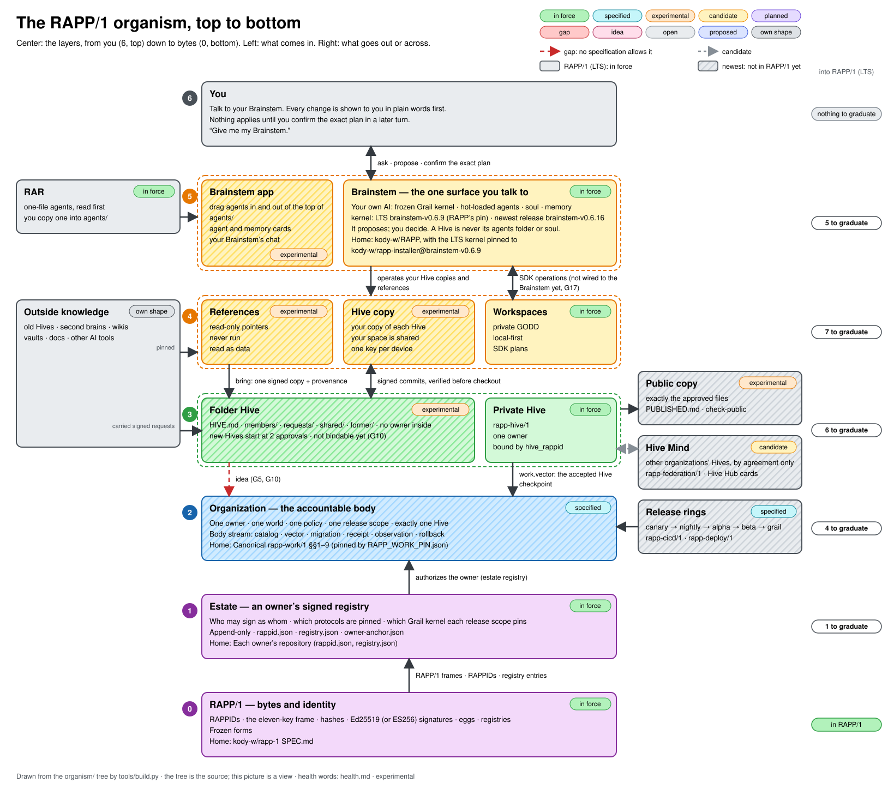

<!-- GENERATED from organism/ by organism/tools/build.py. Edit the part files and rebuild. -->

# The RAPP/1 organism, top to bottom

> **Generated from [`organism/`](organism/).** Do not edit this file by hand: edit the part files there, then run `python3 organism/tools/build.py`. The same organism on one page is its genome, [`organism/ORGANISM.md`](organism/ORGANISM.md).

**Status: experimental map.** It describes what exists and what is proposed, and changes nothing by itself. Specifications decide; this map only points at them. Where they disagree, the specification wins. It is a companion to the draft [`CONSTITUTION.md`](CONSTITUTION.md).

**How to read the graph:**
- The **center column** stacks the layers from you (6, top) down to bytes (0, bottom).
- The **left column** is what flows in: outside knowledge and reviewed agents.
- The **right column** is what goes out or across: public copies and other organizations, and the release rings whose evidence comes back in.
- **Tags** show health, in the words of [`organism/health.md`](organism/health.md). A red dashed arrow is a crossing no specification allows yet; a gray dashed one is a candidate.
- **Plain boxes** in force are RAPP/1, the LTS release people pull. **Striped boxes** are newest: not in RAPP/1 yet. Inside each layer, the RAPP/1 cells come first and the newest cells after them. **Dotted white boxes** ship in neither: you, and outside knowledge.
- The **far right column** says what each layer still needs to graduate into RAPP/1 (section 7).

The graph is drawn from the tree, like its other views: [Excalidraw](organism/views/organism.excalidraw), [text](organism/views/graph.txt), [one printable page](organism/views/one-page.html) and [what it takes to lock RAPP/1 LTS](organism/views/lock-in.html).

## 1. The layers, top to bottom

| # | Layer | What it is | Who decides | Signed with | Home | Health |
|---|---|---|---|---|---|---|
| 6 | **You** | “Give me my Brainstem.” You talk; a Hive change is shown in plain words first, and you confirm it | You | Your confirmation of an exact plan, in a later turn (the Hive agent) | — | — |
| 5 | **Brainstem** | The one surface you talk to: your own AI. Frozen Grail kernel, hot-loaded agents (the Hive agent is one file), soul and memory | You, in conversation | Nothing by itself: its Hive agent proposes, you confirm | [`kody-w/RAPP`](https://github.com/kody-w/RAPP), with the LTS kernel pinned to `kody-w/rapp-installer@brainstem-v0.6.9` | in force (the LTS kernel, pinned by RAPP's unsigned `KERNEL_PIN.json` until an estate declares it, G15); the default install still gives the newest kernel |
| 4 | **Your device** | Your copy of each Hive, your read-only references and your private workspaces, with one key per device per Hive | You | Your device key | The Hive agent's private state (`<hive>/.git/rapp-hive/`); RAPP Workspace/1 | experimental (Hive side); specified (workspaces) |
| 3 | **Hive** | Where the members share work: a `rapp-hive/1` Private Hive (in force, and the only kind of Hive an organization can bind), a folder Hive (experimental), or a distributed Hive of many repositories (experimental) | The members, by the approvals number in a folder Hive; the one owner of a Private Hive | SSH-signed commits in a folder Hive; signed RAPP/1 frames in a Private Hive | Folder Hive: [`kody-w/rapp-model-hive`](https://github.com/kody-w/rapp-model-hive/tree/experimental/hive-md) `HIVE-MD.md`. Private Hive: [`rapp-hive/1`](protocols/rapp-hive/1/SPEC.md) | in force (`rapp-hive/1` Private Hive); experimental (folder Hive, distributed Hive) |
| 2 | **Organization** | The accountable body: one owner, one world, one policy, one release scope, and exactly one Hive. Its body stream holds its declaration, then catalogs, Hive vectors, migrations, receipts, observations and rollbacks | The accountable owner, under the estate's rules | RAPP/1 frames | Canonical `rapp-work/1` §§1–9 (pinned by [`RAPP_WORK_PIN.json`](RAPP_WORK_PIN.json)) | specified; no estate has activated canonical `rapp-work/1` yet (G16); cannot bind a folder Hive yet (G10) |
| 1 | **Estate** | An owner's signed registry: who may sign as whom, which protocols are pinned, which Grail kernel each release scope pins (RAPP/1 §§11.1, 13.3) | The estate owner | RAPP/1 §13 registry entries | Each owner's repository (`rappid.json`, `registry.json`); the kody-w estate's signed registry is `ecosystem-spec.json` in `kody-w/rapp-map`, anchored by the owner rappid in `kody-w/rapp-1`'s README | in force; no estate declares the Brainstem's kernel yet (G15) |
| 0 | **RAPP/1** | Bytes and identity: RAPPIDs, the eleven-key frame, hashes, signatures, eggs, registries | The protocol itself (frozen forms) | Ed25519 (or ES256) detached JWS | [`kody-w/rapp-1`](https://github.com/kody-w/rapp-1) `SPEC.md` | in force |

Inside layer 5, Brainstem:

| Part | What it is | Home | Health | Channel |
|---|---|---|---|---|
| **Brainstem app** | The Brainstem as a small desktop app: its RAPP Workspace shows two roots, `agents/` and Brainstem data (read-only); cards explain each agent and each memory file in plain words, reading agent files without running them; the Brainstem's own chat opens in a tab | [`kody-w/RAPP`](https://github.com/kody-w/RAPP/tree/experimental/brainstem-app), branch `experimental/brainstem-app` (`brainstem-app/`): an overlay on a pinned Code - OSS fork (`kody-w/vscode` at tag 1.139.0) | experimental | newest |

Inside layer 4, Your device:

| Part | What it is | Home | Health | Channel |
|---|---|---|---|---|
| **Workspaces** | Your private, local-first workspaces (GODD); the SDK changes them only by exact plans, and never replaces your own files | RAPP Workspace/1; `rapp-work-sdk/1` as specified in `kody-w/rapp-work` (`kody-w/rapp-workspace` carries a different document under the same id) | specified; no estate activates RAPP Workspace/1 or `rapp-work-sdk/1` yet | newest |
| **References** | Read-only pointers to outside knowledge, never run, synced or changed | Hive folder convention, “References” | experimental | newest |
| **Hive copy** | Your copy of each Hive; its `members/<you>/` is shared, and every member can read it | The Hive agent's private state (`<hive>/.git/rapp-hive/`) | experimental | newest |

Inside layer 3, Hive:

| Part | What it is | Home | Health | Channel |
|---|---|---|---|---|
| **Folder Hive** | A folder of markdown with git underneath: `HIVE.md`, `.gitattributes`, `members/`, `requests/`, `shared/`, `former/`, and no owner inside | [`kody-w/rapp-model-hive`](https://github.com/kody-w/rapp-model-hive/tree/experimental/hive-md) `HIVE-MD.md` | experimental; not bindable to an organization yet (G10) | newest |
| **Private Hive** | The `rapp-hive/1` Private Hive: the only kind of Hive an organization can bind (one `hive_rappid`), with one owner | [`rapp-hive/1`](protocols/rapp-hive/1/SPEC.md) | in force; pinned by `kody-w/rapp-work`'s own signed registry, and the kody-w estate's registry does not pin it yet | RAPP/1 |

Beside the stack:

| Column | Part | What it is | Home | Health | Channel |
|---|---|---|---|---|---|
| In | **RAR** | The public registry of single-file agents | [`kody-w/RAR`](https://github.com/kody-w/RAR) (`rapp-registry/1.1`; its README still says 1.0) | specified; no estate pins `rapp-registry/1.1` yet, and the LTS kernel installs from RAR's moving `main` | newest |
| In | **Outside knowledge** | Old Hives, second brains, Obsidian vaults, markdown wikis, docs folders, other AI tools' own workspaces | Wherever they live; never changed | own shape | outside |
| Out | **Public copy** | A separate, reviewed repository holding exactly the approved files, plus `PUBLISHED.md` | The Hive folder convention; DOGG rules of `rapp-hive/1` §2 | experimental | newest |
| Across | **Hive Mind** | The network of sovereign Hives: discovery through Hive Hub cards, and agreements between organizations | [`rapp-federation/1`](protocols/rapp-federation/1/SPEC.md) (candidate); [`kody-w/hive-hub`](https://github.com/kody-w/hive-hub/tree/experimental/organism-fit) | candidate; its own status line says “not estate-activated”, though `kody-w/rapp-work`'s own signed registry pins it; folder Hives through Hive Hub cards (experimental, G12) | newest |
| Out | **Release rings** | Estate-named stages over `rapp-cicd/1` §3: here canary, nightly, alpha, beta, the Preprod gate, then the production ring (the grail) | `rapp-cicd/1` §3 and `rapp-deploy/1` in `kody-w/rapp-1` | specified; the kody-w estate pins `rapp-cicd/1` and `rapp-deploy/1`, but no estate names these rings or has run a release through them | newest |
| Across | **Distributed Hive** | The RAPP/1 network as one Hive, found by raw URL: RAPP's seed → beacon → `estate.json` → Hive root → a pointer per repository → its `.rapp/member.md`, at its LTS commit | `DISTRIBUTED-HIVE.md`, HIVE-MD “Remote member spaces” and the Hive agent's `resolve`, in [`kody-w/rapp-model-hive`](https://github.com/kody-w/rapp-model-hive/tree/experimental/hive-md-distributed) (branch `experimental/hive-md-distributed`); RAPP proposal 0020, a draft on branch `experimental/proposal-0020-distributed-hive` | experimental; the seed does not reach it yet | newest |

## 2. Crossings: how anything moves between layers

Every arrow in the graph is one row here, pointing the same way. Transport carries bytes; signatures decide (Constitution Article 7).

| From → to | What crosses | Authorized by | Home | Health |
|---|---|---|---|---|
| You ↔ Brainstem | A request, and the Brainstem's answer; for a Hive change, a plan in plain words | Your request. The LTS kernel runs the agents its model calls at once; the Hive agent applies only a plan you confirm in a later turn, bound to its hash | `kody-w/rapp-installer` `rapp_brainstem/brainstem.py` (`run_tool_calls`); the Hive agent | in force (the kernel runs the agents its model calls, without asking); the later-turn hash gate is experimental (the Hive agent) |
| RAR → Brainstem | One agent file | You add it: copy the file into `agents/`, or press Add in the LTS kernel's RAR browser, which loads it at once | RAPP Constitution XVII; the RAR browser and `/agents/import` in `kody-w/rapp-installer` `rapp_brainstem/` | in force |
| Brainstem → Your device | A key, a pinned root, a pinned reference | Your confirmed plan | Hive agent | experimental |
| Brainstem ↔ Workspaces | Status, verify, discover, scaffold, update, migrate | `plan_sha256`, applied explicitly | `rapp-work-sdk/1` §2 | specified for the SDK; a Brainstem agent is drafted, not accepted (G17) |
| Outside knowledge → Your device | Nothing: a reference is a read-only pointer | Your confirmed plan pins it | Hive folder convention, “References” | experimental |
| Hive copy ↔ Folder Hive | Commits, both ways | Your device key's signature, judged at its parent; the device verifies before it checks anything out | Hive folder convention | experimental |
| References → Folder Hive | One signed copy stamped with `brought_from` and `brought_sha256` | Your signature; the plan says it will be visible to the Hive's members | Hive folder convention | experimental |
| Folder Hive → Public copy | Exactly the files of an approved manifest | The approvals number; `check-public` verifies the copy | Hive folder convention; `rapp-hive/1` §2 | experimental |
| Hive ↔ Hive Mind | Agreements, grants, receipts | Both owners' signed consent and a bilateral agreement (`rapp-federation/1` §6). Crossing a world boundary needs explicit authorization on both sides, with purpose and provenance (historical root [`SPEC.md`](SPEC.md) §3); `rapp-hive/1` §12 refuses cross-world assimilation | `rapp-federation/1` | candidate; folder Hives can be found through Hive Hub cards (experimental, G12) |
| Outside knowledge → Folder Hive | An old Hive's signed join requests | The old signatures, checked with RAPP/1's hash and signature math; the new Hive's rules | Hive folder convention; `previous:` | experimental |
| Folder Hive → Organization | “The organization accepted this Hive state” | Nothing yet (proposed: a folder-Hive organization records the accepted head in a signed vector, its owner signing as the Hive's notary; G5, G10) | Canonical `rapp-work/1` §§1, 4 | **gap (G10)** |
| Private Hive → Organization | A signed Hive vector (`work.vector`) naming the accepted checkpoint | The organization's signer; a consumer accepts it only after verifying the checkpoint under `rapp-hive/1` | Canonical `rapp-work/1` §§2, 4 | specified (G16) |
| Release rings → Organization | Release evidence, as verified-release receipts and bounded observations | The organization's signer; a healthy verdict needs RAPP Deploy health evidence | Canonical `rapp-work/1` §§5, 7, 8; `rapp-cicd/1`; `rapp-deploy/1` | specified (G16) |
| Estate → Organization | The owner's authority | The estate's signed registry and its time-scoped owner rules | Canonical `rapp-work/1` §2; RAPP/1 §13 | specified (G16) |
| Estate → Distributed Hive | The estate's pin of the Hive root: a `hives[]` entry in `estate.json` naming the public copy's commit and the hash of its `PUBLISHED.md` | The estate owner's choice of commit. Hashes prove integrity; authenticity needs the estate owner's signed registry | RAPP proposal 0020 (§§1, 3, 6), a draft; RAPP Constitution Article XLVI | candidate; `estate.json` is a placeholder today, and a draft entry pins the root |
| RAPP/1 → Estate | Frames, RAPPIDs and registry entries | RAPP/1's own hash and signature checks | RAPP/1 §§6, 7, 13 | in force |

## 3. End to end, through every layer

1. **A teammate joins.**
   - Their Brainstem writes one signed request file. It may arrive by any channel.
   - Members admit them by moving it into `members/<name>/keys/`, with enough approvals.
   - The Hive's next verified head carries them. Proposed (G10): a folder-Hive organization could later record that head in a signed vector.
2. **Your second brain feeds the team.**
   - You reference your Obsidian vault; nothing is copied.
   - Your Brainstem reads it as fenced, unattributed data and proposes to bring three notes into `shared/wiki/`, saying they will be visible to the Hive's members.
   - You confirm, and one signed commit carries them, with `brought_from` stamps.
3. **The team publishes a page.**
   - A manifest in `members/<you>/publish/` lists exact files and hashes. Members approve it.
   - Your Brainstem copies exactly those files into the separate public copy, with `PUBLISHED.md`.
   - Anyone runs `check-public`; a member adds `--hive` to check the signers too.
   - Proposed (G5): the organization's owner could later notarize the publication with RAPP/1.
4. **An old Hive moves.**
   - The new folder Hive names the old one in `previous:`.
   - The old Hive's signed join requests come along unchanged. No request is lost: carried requests wait for admission.
   - Everything else stays where it is, as a reference, until someone needs it. Old clients keep seeing the old Hive.
5. **Something goes wrong.**
   - A change signed by no member, or breaking a rule, is refused with proof. Nothing is built on it.
   - A member resets the shared copy to the last change that verified. No accepted history is lost or rewritten.
6. **Two organizations work together (candidate; Private Hives only).**
   - One finds the other, through Hive Hub or a signed `federation.discovery` advert, and they sign an agreement under `rapp-federation/1`.
   - Knowledge crosses only by that agreement, or from a public copy. Membership is never shared.
7. **The Hive agent grows up.**
   - It starts in the frontier track's canary ring, where the draft Work Constitution places the Hive folder convention.
   - A real team must use it for a real week before nightly.
   - It then moves through alpha and beta, and the Preprod gate, to the production ring (the grail), with `rapp-cicd/1` evidence at each step.
   - It stays an agent: it never goes into the frozen Grail kernel.

## 4. What holds everywhere

- **RAPP/1 wins, then `rapp-work/1`.** Its profiles come next, then everything else.
- **Transport carries; signatures decide.** No account, URL, repository or AI vendor decides who is in or what may leave.
- **In by signed copy, out by approved copy.** That is how knowledge moves; the Hive between stays small and verified.
- **Other people's text is data.** Nothing from someone else runs on your machine or instructs your AI until you adopt it.
- **Propose, confirm, apply.** Every change to a Hive or a workspace is proposed, confirmed in a later turn, and applied as one exact step (a signed commit, inside a Hive).
- **Accepted history is never rewritten.** Old records are carried byte for byte.
- **The Brainstem is the one surface you talk to.** Every other layer is plumbing.
- **Front doors stay editable.** Frozen identities never pin human-facing docs: READMEs, badges and “Start here” links. They pin only normative bytes: specifications, schemas, reference code, tests and AI instruction files such as `SKILL.md`. RAPP Workspace/1 still pins its READMEs, and so does `kody-w/rapp-workspace`'s copy of `rapp-work-sdk/1` (G24).
- **Only top-level `agents/*_agent.py` files are live.** Every folder is organization: loading or unloading an agent is a file move, a drag and drop. It is the Grail kernel's rule: its `load_agents()` is a flat glob (`kody-w/rapp-installer` `rapp_brainstem/brainstem.py`, lines 1202–1205 at `brainstem-v0.6.9`). Every Grail release is flat, from `v0.1.0` (`8220932`, 2026-03-05) on; only the Grail's first core, before any release (`91d13ce`, 2026-02-24), searched subfolders. RAPP's own copy searched them for about ten days, from `c1f356e` (2026-04-21) to `06d16f1` (2026-05-01), so RAPP's tags `brainstem-v0.10.0` to `brainstem-v0.12.1` shipped that loader (RAPP proposal 0001, “Has it always been this way?”). RAPP's Constitution now states the rule for the local Brainstem (`kody-w/RAPP#119`, `#124`). RAPP's cloud Brainstem still loads differently (G19), and documents that still teach subfolders are open drift issues, filed under RAPP Constitution Article LIII.1 (in RAPP, `kody-w/RAPP#126` to `#130`).

## 5. Keeping it healthy

A layer is healthy when it has a specification with an owner, a reference that runs, a check anyone can repeat, and its gaps written down.

| Layer or part | Check |
|---|---|
| RAPP/1 | Its conformance suite in `kody-w/rapp-1` |
| Estate | `python3 tools/check.py` (signed registry, plus `rapp-hive/1` and `rapp-federation/1` conformance), `python3 -m pytest` and `python3 tools/release_inventory.py --check` in `kody-w/rapp-work`; for the kody-w estate, `kody-w/rapp-map`'s registry verifier |
| Organization | `python3 work_conformance.py` in `kody-w/rapp-1`, the canonical `rapp-work/1` gate |
| Folder Hive | For the folder convention: `python agents/hive_agent.py check <hive>`, `check-public <copy>`, and `tools/build_example.py --check` with the tests (CI on macOS, Linux and Windows) |
| Private Hive, Workspaces, Hive Mind | `python3 tools/check.py` (signed registry, plus `rapp-hive/1` and `rapp-federation/1` conformance), `python3 -m pytest` and `python3 tools/release_inventory.py --check` in `kody-w/rapp-work` |
| Private Hive, Workspaces | For `rapp-hive/1` and Workspace/1: the `kody-w/rapp-workspace` CI jobs (core pins and conformance, Private Hive suite) |
| Brainstem, RAR | Each repository's own test suite and runner |
| Hive Mind | `python tools/build.py --check` and the tests in `kody-w/hive-hub` (branch `experimental/organism-fit`) |

## 6. Gap register

| ID | Gap | Home | Fix | Status | Phase | Who acts |
|---|---|---|---|---|---|---|
| G1 | A `rapp-hive/1` roster can never change | `rapp-hive/1` §3 | An owner-signed later declaration: `kody-w/rapp-work` proposal 0001, a draft on branch `experimental/gap-g1-roster-declaration` | proposed | 3 | spec owner |
| G2 | SDK plans cannot move a file | `rapp-work-sdk/1` §§2, 4 | A `move` plan whose undo is its exact inverse: `kody-w/rapp-work` proposal 0002, a draft on branch `experimental/gap-g2-move-action` | proposed | 3 | spec owner |
| G3 | SDK discovery misses `*_agent.py` | `rapp-work-sdk/1` §11 | Record them as inert data: `kody-w/rapp-work` proposal 0003, a draft on branch `experimental/gap-g3-agent-discovery` | proposed | 3 | spec owner |
| G4 | SDK migration refuses repository-seeded Hives and long world ids | `rapp-work-sdk/1` §10; the 64-character world id cap in `rapp-hive/1` `schema.json` `$defs/label` and the SDK's `migration.py` | An opt-in pointer-only successor, which records a world id of up to 128 characters as written: `kody-w/rapp-work` proposal 0004, a draft on branch `experimental/gap-g4-migration-successors` | proposed | 3 | spec owner |
| G5 | One owner only, so co-equal groups do not fit | Canonical `rapp-work/1` §2 | The owner as the Hive's notary, who signs at the edge only what the Hive approved, naming that approval: `kody-w/rapp-1` proposal 0005, a draft on branch `experimental/gap-g5-owner-notary` | proposed | 3 | spec owner |
| G6 | Implementations refuse owner succession | `rapp-hive/1` §14.2 (the reference fails closed); `rapp-work-sdk/1` §12 | Implement RAPP/1's time-scoped owner succession (RAPP/1 §§13.2, 13.3) in the `rapp-hive/1` reference and the SDK: `kody-w/rapp-work` proposal 0006, a draft on branch `experimental/gap-g6-owner-succession`. A lost or compromised owner root key still needs a new trust anchor, given out of band (§13.1) | proposed | 3 | spec owner |
| G7 | SDK verification accepts an edited instruction file | `rapp-work-sdk/1` §7 | Inventory AI instruction files, and refuse new ones: `kody-w/rapp-work` proposal 0007, a draft on branch `experimental/gap-g7-instruction-inventory` | proposed | 3 | spec owner |
| G8 | Hive members are names bound to keys, not RAPPIDs | RAPP/1 §§6.1, 10; [root `SPEC.md`](SPEC.md) §2 | Constitution Part V.4 | proposed | 1 | you |
| G9 | A git commit is not authority in canonical `rapp-work/1` | Canonical `rapp-work/1` §9 | Constitution Part V.2 | proposed | 1 | you |
| G10 | An organization cannot bind a folder Hive | Canonical `rapp-work/1` §§1, 2, 4 | A sibling profile, `rapp-work-folder-hive/1`: a folder-Hive organization names its one Hive by id, first commit and founder key fingerprint, and each signed vector names an accepted head after the previous one, or observes the previous head again. `kody-w/rapp-1` proposal 0010, a draft on branch `experimental/gap-g10-folder-hive-binding` | proposed | 3 | spec owner |
| G11 | “Organization” means two things | `rapp-work-sdk/1` §7 | Rename the SDK's pointer-only object “workspace index”: `kody-w/rapp-work` proposal 0011, a draft on branch `experimental/gap-g11-workspace-index` | proposed | 3 | spec owner |
| G12 | Hive Hub dial records did not describe folder Hives | `kody-w/hive-hub` (branch `experimental/organism-fit`) | A Hive card carries the Hive id, its first commit, the founder key fingerprint and a channel, and may carry an address; joining writes one request file from the person's own Brainstem | experimental | 5 | engineering |
| G13 | Outside knowledge had no way in | Hive folder convention | References: read-only pointers; bring by signed copy with provenance | experimental | 5 | engineering |
| G14 | The Hive agent's path to the production ring | Release rings; RAPP/1 §11.1 (new behavior stays outside the frozen kernel) | A real team's week in canary, then nightly, alpha, beta, the Preprod gate and the production ring | open | 5 | engineering |
| G15 | No estate declares the Brainstem's kernel | RAPP/1 §§11.1, 13.3; `KERNEL_PIN.json` in `kody-w/RAPP` | The estate owner signs a `grail-kernel` entry for each release scope: the LTS scope, which pins `brainstem-v0.6.9` for good, and one successor scope per newer kernel (`brainstem-v0.6.16` now); a scope is never rebound. Both scopes' candidate release manifests are prepared, unsigned, on `kody-w/rapp-estate` branch `experimental/rapp1-distributed-hive` | proposed | 4 | estate owner |
| G16 | No estate has activated canonical `rapp-work/1` | Canonical `rapp-work/1` §1 | An estate appends the canonical `rapp-work/1` protocol entry, its seven `work.*` kinds and a `rapp-hive/1` pin; the kody-w estate already pins `rapp-cicd/1` and `rapp-deploy/1` | open | 4 | estate owner |
| G17 | The Brainstem does not call the RAPP Work SDK | `rapp-work-sdk/1` §2; `kody-w/RAPP` | A Brainstem agent that calls the six SDK operations and applies only exact plan hashes: `kody-w/rapp-work` proposal 0017, a draft on branch `experimental/gap-g17-brainstem-sdk-agent` | proposed | 5 | engineering |
| G19 | The cloud Brainstem loads agents differently | `kody-w/RAPP` Tier 2, `rapp_swarm/` | RAPP proposal 0002, “Which agent files the cloud Brainstem loads”, a draft on branch `experimental/proposal-0002-tier2-parity` (CI green, no pull request yet). Its recommended option: top-level `*_agent.py` files only, and the 5-minute cache kept as a documented cloud detail | proposed | 1 | you |
| G20 | The Brainstem app's path to the production ring | Release rings; `kody-w/RAPP` branch `experimental/brainstem-app` | Signed builds for macOS, Windows and Linux, a real week of use, then nightly, alpha, beta, the Preprod gate and the production ring | open | 5 | engineering |
| G22 | “Workspace” names two things | RAPP Constitution Articles XVI and XVII; RAPP Workspace/1 | Keep the names apart: `agents/` is the Brainstem's agents folder, not a RAPP Workspace, and Article XVI's workspace is Brainstem data. RAPP proposal 0010, a draft on branch `experimental/gap-g22-workspace-names` | proposed | 3 | spec owner |
| G23 | The LTS Windows installer cannot pin the LTS kernel | `kody-w/rapp-installer` `install.ps1` at `brainstem-v0.6.9` | Both one-liners read `BRAINSTEM_VERSION`, and accept only a release tag, checked before anything changes: open pull request `kody-w/rapp-installer#49` (CI green) | proposed | 2 | engineering |
| G24 | RAPP Workspace/1's frozen identity pins its READMEs | `kody-w/rapp-workspace` `protocols/rapp-workspace/1/manifest.json` (`repository_evidence`), written by `protocols/rapp-workspace/1/reference/pins.py` | Pin only normative bytes, and leave the READMEs out, before an estate activates RAPP Workspace/1: `kody-w/rapp-workspace` proposal 0024, a draft on branch `experimental/gap-g24-editable-front-door` (CI green, no pull request yet) | proposed | 3 | spec owner |

Changes to canonical bytes need an upstream revision in `kody-w/rapp-1` and a re-pin. [Root `SPEC.md`](SPEC.md) is historical and never edited.

## 7. RAPP/1 LTS: what it takes to lock the whole thing

- One estate-signed `release_scope` whose Grail pin never moves; each release in it pins every component.
- Everything in it is in force; nothing in it is experimental.
- The newest channel holds experiments until they graduate: one successor scope per newer kernel.

It pins the LTS kernel `brainstem-v0.6.9`, `rapp-hive/1`, `rapp-work/1`, RAPP Workspace/1, `rapp-work-sdk/1`, `rapp-registry/1.1`, `rapp-cicd/1`, `rapp-deploy/1`, and the agents and apps that ship with it. RAPP/1 §11.1: the pin is “a permanent compatibility anchor”, and “A successor uses a new `release_scope`”. §13.3: at most one `grail-kernel` entry per scope, and a `protocol` entry per adopted protocol. `rapp-cicd/1` §2: a release lists every part.

RAPP/1 is the one LTS release people pull. Five phases lock it, in order, with the owner's decisions first; it ends as a distributed Hive.

The five phases, in order:

| Phase | Who acts | Steps | Gaps it closes |
|---|---|---|---|
| 1. Decide | you, about an hour | accept or refuse RAPP proposal 0002 (G19), Tier 2 loading: a draft on `experimental/proposal-0002-tier2-parity`; ratify the RAPP Work Constitution and its Part V (G8, G9); done: RAPP proposal 0001 and its amendment are merged (`kody-w/RAPP#119`, `kody-w/RAPP#124`), so RAPP's Constitution says only top-level agents are live | G8, G9, G19 |
| 2. Zero drift, clean pull | engineering | fix RAPP's and RAR's non-conformant eggs and RAR's bounded scan (`kody-w/RAPP#121`, which only the maintainer merges, and `kody-w/RAR#1116`; both open); give rapp-model-hive's frames a trusted anchor (`kody-w/rapp-model-hive#2`, open; it needs the owner's registry entries); re-sweep until every repo of the RAPP/1 stack is certified (the dogfood); keep the default pull clean: default branches and the LTS install carry only in-force parts; one front door keeps the network unified and tracked; pin the Windows LTS install (G23, which only the owner merges) | G23 |
| 3. Close the specification gaps | spec owner | RAPP/1 core additions land before the estate signs: rev-17, a draft on `kody-w/rapp-1` `experimental/rapp1-core-*`, adds release pins, lifecycle notices and stream signers; rapp-hive/1 (G1, G6); rapp-work-sdk/1 (G2, G3, G4, G7, G11); rapp-work/1, by sibling profiles (G5, G10); RAPP's Constitution and RAPP Workspace/1 (G22, G24); a gap that cannot close in time waits for a later RAPP, with the owner's sign-off | G1, G2, G3, G4, G5, G6, G7, G10, G11, G22, G24 |
| 4. Switch it on | estate owner | sign both kernel channels: a `grail-kernel` entry for the LTS scope, and one for a successor scope (G15); sign the remaining protocol pins; that estate-activates the Workspaces and RAR; activate `rapp-work/1` (G16), so the Organization is in force; authorize the network pulse signer: pulses (experimental) version the map and the network's health; switch on the Distributed Hive: accept RAPP proposal 0020, then merge the drafts of beacon 1.1, `estate.json` and the operator's acceptance in RAPP's seed | G15, G16 |
| 5. Graduate into RAPP/1 | engineering, through the rings | graduate each newest part through the rings: Folder Hive, Hive copy and the Hive agent (G14), References (G13), Hub cards (G12), Public copy, the Brainstem app (G20), the Brainstem's SDK agent (G17), the Distributed Hive; then Hive Mind, once an estate accepts `rapp-federation/1`, and the Release rings, once a graduation uses them; merge what graduated; the rest stays out of what people pull; tag the lock once the clean-pull check passes again; sweep for drift on a schedule | G12, G13, G14, G17, G20 |

**Keep the default pull clean** (phase 2): on 2026-09-26, `git grep -l -i experimental origin/HEAD` counted the files on each default branch that mention “experimental”: rapp-hive-public 342, RAR 50, RAPP 46, rapp-workspace 26, rapp-hive-hub 19, rapp-installer 9, rapp-model-hive 9, hive-hub 6, lisppy 1, rapp-1 0, rapp-work 0, rapp-drift-lint 0, hive-hub-join 0, hive-hub-mcp 0, rapp-hive-hub-join 0. Mentions, not problems; some are legitimate. Recount at lock time. One front door: **proposed:** the installer's “Start here”, where every header links, leads with the RAPP/1 LTS install (`kody-w/rapp-installer#48`, open; only the owner merges it) · **experimental:** 13 of the stack's 15 default branches show their earned RAPP/1 badge and a “Start here” link; `rapp-installer` waits on #48, `rapp-workspace` on G24 · **experimental:** the drift sweep sets each status; the portfolio in `kody-w/rapp-hive-public`, the network's notice board, shows 12 of the stack's 15 certified, and every repo's channel and lifecycle.

What each layer still needs, top to bottom:

| Layer | Into RAPP/1 |
|---|---|
| 6 You | nothing to graduate |
| 5 Brainstem | 5 to graduate (G17, G19, G20, G23, RAR) |
| 4 Your device | 8 to graduate (G2, G3, G4, G7, G13, G14, G22, G24) |
| 3 Hive | 6 to graduate (G1, G6, G8, G9, G12, Public copy) |
| 2 Organization | 5 to graduate (G5, G10, G11, G16, Release rings) |
| 1 Estate | 2 to graduate (G15, Distributed Hive) |
| 0 RAPP/1 | in RAPP/1 |

**Where it ends: the Distributed Hive** (experimental; the seed does not reach it yet): RAPP/1 LTS resolves as a distributed Hive, so a person pulls full RAPP/1 from static data. The RAPP/1 network as one Hive, found by raw URL: RAPP's seed → beacon → `estate.json` → Hive root → a pointer per repository → its `.rapp/member.md`, at its LTS commit.

## 8. Words

- **RAPP/1 (LTS):** the one release people pull; everything in it is in force. One estate-signed `release_scope` holds it: its Grail pin never moves (RAPP/1 §11.1), and each release in it pins every component (`rapp-cicd/1` §2).
- **Newest:** successor releases, where experiments live until they graduate. Each newer kernel gets its own `release_scope`, and two scopes never pin the same kernel (RAPP/1 §11.1).
- **DOGG:** public-safe data: PII-free, and safe to publish anywhere (`rapp-hive/1` §2).
- **GODD:** private data. It stays local unless its owner selects it (`rapp-hive/1` §2).
- **frontier track:** the release track where new, experimental agents and profiles start.
- **canary ring:** the stage after development and test (`rapp-cicd/1` §3); here, where a few real users try a release first.
- **notary (proposed):** the owner signing, at the edge, only what a Hive already approved. Drafts in `kody-w/rapp-1` propose it; no specification provides it yet (G5, G10).
- **Hive Mind:** the network of sovereign Private Hives, `urn:rapp:hive-mind`. Knowing the name confers no rights (`rapp-federation/1` §1).
- **dial record:** on Hive Hub's `main`, a record named by its SHA-256 Dial Record ID, that tells a device how to reach a declared Hive. It grants no access.
- **join card:** on Hive Hub's `main`, a content-addressed card, often shown as a QR code, that leads a device to a Hive's dial record.
- **`work.vector`:** the signed `rapp-work/1` frame that records which authenticated `rapp-hive/1` checkpoint an organization accepted.
- **network pulse (experimental):** one RAPP/1 `body.pulse` frame per crawl of the network portfolio, on the network's body stream and chained by `prev`. `kody-w/rapp-hive-public` published the first, `seq` 0, and one per crawl since. The stream's rappid is keyless, so it can never sign for itself (RAPP proposal 0020), and its `sig` stays null until the estate owner signs the pulses, or grants another key the stream through rev-17's `stream-signer` entry, a draft (RAPP/1 §§7.1–7.4, 10; rev-17 §§13.3, 13.7). Each pulse versions the map and the network's health: the portfolio keeps every version's subway map, and its timeline lists them all.
- **portfolio (experimental):** the RAPP/1 network's notice board, [published](https://kody-w.github.io/rapp-hive-public/portfolio/PORTFOLIO.html) in `kody-w/rapp-hive-public`: each repository's version, its LTS pin, its channel (`rapp1-lts` or `newest`) and its lifecycle (`active`, `deprecated`, `superseded` or `archived`), with notices of deprecations and moves. Each crawl is a new version, recorded by one network pulse, and only the owner saves a notice.
- **station, Hive root:** in a distributed Hive, a station is one public repository, with its member space in `.rapp/`; a Hive root is a Hive's public copy, which keeps one pointer per station (HIVE-MD, “Remote member spaces”, a draft).
- **`release_scope`:** the release family an organization declares (`rapp-work/1` §2), and that an estate's Grail pin applies to (RAPP/1 §11.1).
- **`previous:`:** the `HIVE.md` field that names old Hives whose signed join requests count as carried requests.
- **LTS and newest kernels:** the Brainstem kernel has the same two channels, by design. RAPP pins the LTS kernel in `KERNEL_PIN.json`; the newest is the newest `brainstem-v*` tag of `kody-w/rapp-installer`, which its `main` ships, and nothing signed pins it yet (G15).
- **Grail and grail:** the Grail is the Brainstem's frozen kernel. RAPP/1 identifies a Grail by its `grail_id`, never by a tag (§11.1), and none is declared yet (G15). Lowercase grail is this project's name for a track's production ring.
- **organism:** RAPP/1 defines it as one running Brainstem with a lasting identity (RAPP/1 §3), though its introduction calls all of RAPP one organism. This map uses it for the whole ecosystem.
